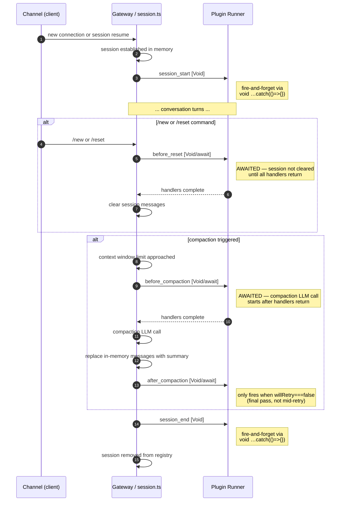
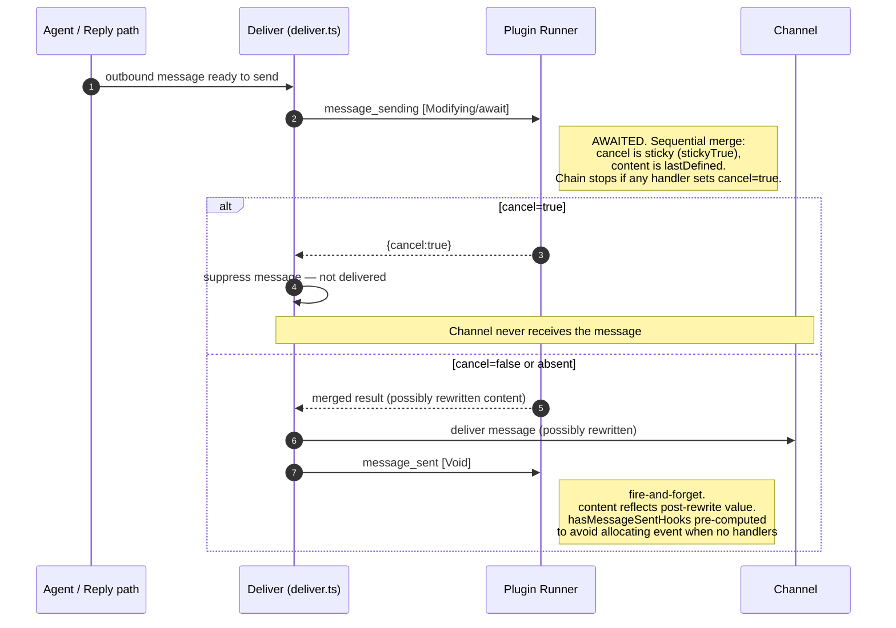
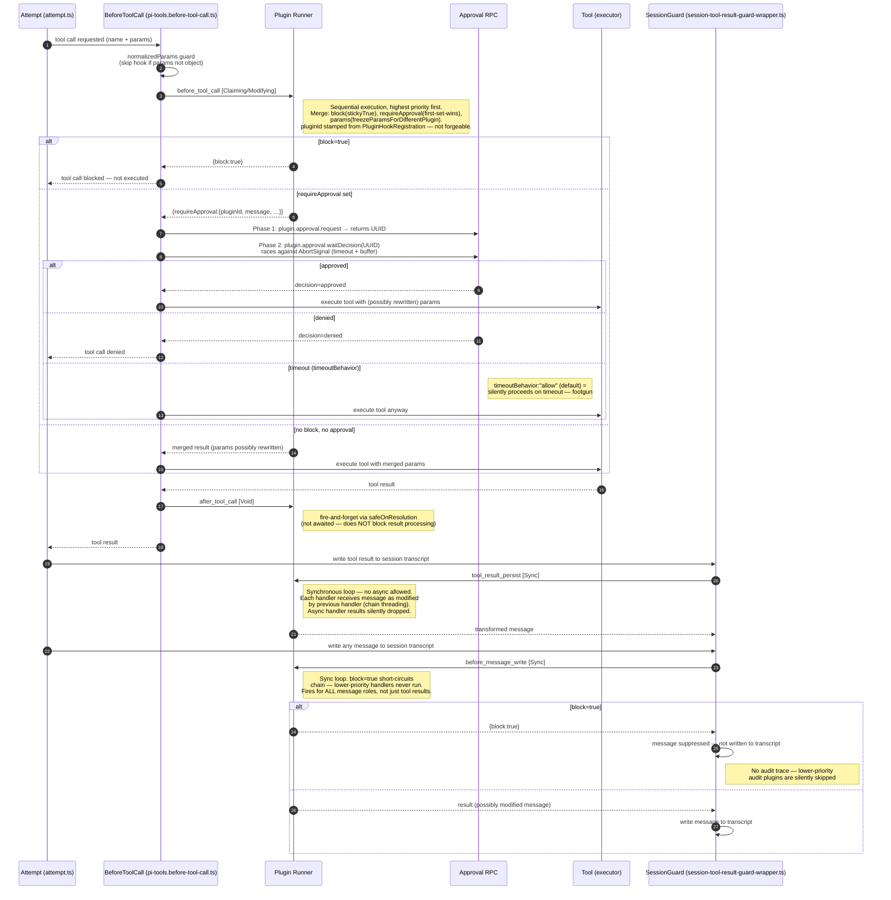
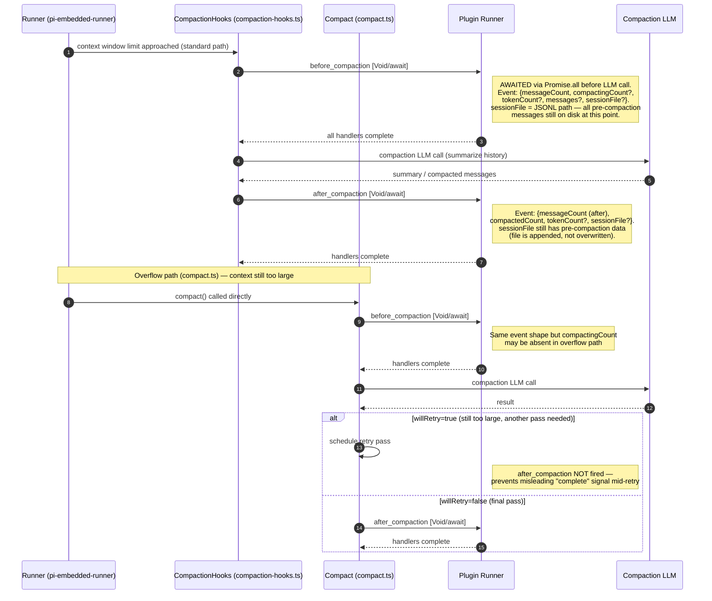
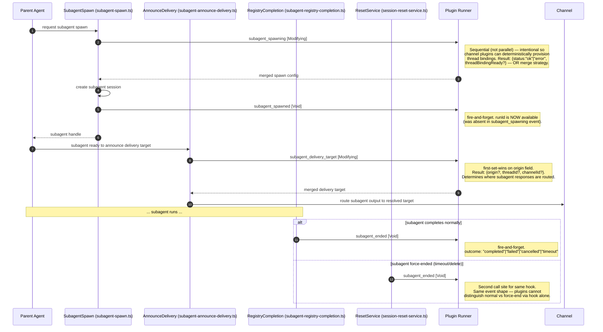
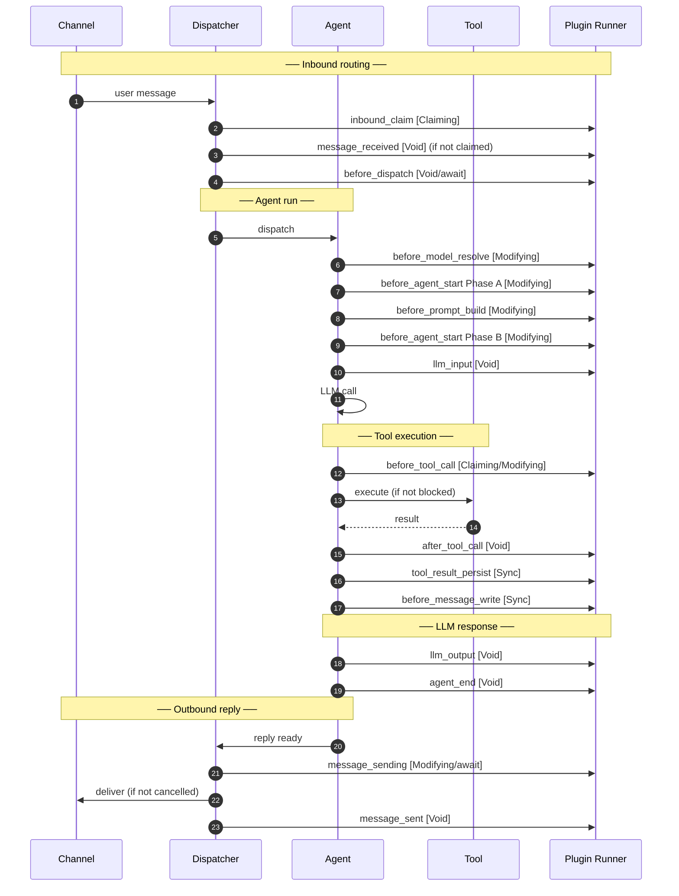

# Hook Sequence Diagrams

## Introduction

The OpenClaw plugin hook system exposes 26 named hooks distributed across seven distinct
pipelines. Each pipeline has its own actors, timing contract, and set of hooks. Reading
a single session document tells you the mechanics of one hook; these diagrams show you
**where each hook sits relative to everything else** — which system components it touches,
what happens before and after it, and whether the caller actually waits for it.

Two properties matter most for plugin correctness and security:

**Execution model** — determines how handlers are called and whether their results
affect the pipeline:

| Label          | Meaning                                                                                                |
| -------------- | ------------------------------------------------------------------------------------------------------ |
| `[Void]`       | Parallel fire-and-forget — caller does not wait; handler exceptions are discarded                      |
| `[Void/await]` | Void model, but caller awaits `Promise.all` before the next pipeline step — handlers run to completion |
| `[Modifying]`  | Sequential — each handler's return value is merged into accumulating state                             |
| `[Claiming]`   | Sequential — first handler returning `{handled:true}` wins; subsequent handlers are skipped            |
| `[Sync]`       | Synchronous loop — no async allowed; async return values are silently dropped                          |

**Awaited vs fire-and-forget** — determines whether a hook can actually gate or modify
the pipeline. A `[Void]` hook that is not awaited is observability only — it cannot
block or alter what the system does next. A `[Void/await]` hook looks identical in
handler code but has a hard ordering guarantee. This distinction is the primary reason
the security analysis in Session 7 treats hooks differently despite some sharing the same
execution model label.

### Diagram Index

| #   | Pipeline                                                                                   | Hooks Covered                                                                                                    |
| --- | ------------------------------------------------------------------------------------------ | ---------------------------------------------------------------------------------------------------------------- |
| 1   | [Gateway Process Lifecycle](#1-gateway-process-lifecycle)                                  | `gateway_start`, `gateway_stop`                                                                                  |
| 2   | [Session Lifecycle](#2-session-lifecycle)                                                  | `session_start`, `session_end`, `before_reset`, `before_compaction`, `after_compaction`                          |
| 3   | [Inbound Message Flow](#3-inbound-message-flow)                                            | `inbound_claim`, `message_received`, `before_dispatch`                                                           |
| 4   | [Outbound Message Flow](#4-outbound-message-flow)                                          | `message_sending`, `message_sent`                                                                                |
| 5   | [Agent Run Lifecycle](#5-agent-run-lifecycle)                                              | `before_model_resolve`, `before_agent_start` (×2), `before_prompt_build`, `llm_input`, `llm_output`, `agent_end` |
| 6   | [Tool Execution Flow](#6-tool-execution-flow)                                              | `before_tool_call`, `after_tool_call`, `tool_result_persist`, `before_message_write`                             |
| 7   | [Compaction Pipeline Detail](#7-compaction-pipeline-detail)                                | `before_compaction`, `after_compaction` (both call sites)                                                        |
| 8   | [Subagent Orchestration Lifecycle](#8-subagent-orchestration-lifecycle)                    | `subagent_spawning`, `subagent_spawned`, `subagent_delivery_target`, `subagent_ended`                            |
| 9   | [Combined Hook Timeline](#9-combined-hook-timeline-all-pipelines-single-conversation-turn) | All 26 hooks across one full conversation turn end-to-end                                                        |

Source references are drawn from the walkthroughs in Sessions 1–6.

---

## 1. Gateway Process Lifecycle

```mermaid
sequenceDiagram
    autonumber
    participant OS as OS / Process
    participant GW as Gateway (server.impl.ts)
    participant PL as Plugin Runner

    OS->>GW: process start
    GW->>GW: Phase 1–10: bind ports, load config,<br/>initialize plugins, register hooks
    GW->>PL: gateway_start [Void]
    Note right of PL: fire-and-forget — gateway does NOT<br/>wait; startup continues immediately
    GW->>GW: Phase 12+: accept connections

    Note over GW,PL: ... runtime ...

    OS->>GW: SIGTERM / shutdown signal
    GW->>PL: gateway_stop [Void/await]
    Note right of PL: runGlobalGatewayStopSafely() AWAITS<br/>all handlers before teardown proceeds
    PL-->>GW: all handlers complete
    GW->>GW: close connections, flush state
    GW->>OS: process exit
```

---

## 2. Session Lifecycle



---

## 3. Inbound Message Flow

```mermaid
sequenceDiagram
    autonumber
    participant CH as Channel
    participant DI as Dispatcher (dispatch-from-config.ts)
    participant PL as Plugin Runner
    participant AG as Agent Runner

    CH->>DI: inbound message arrives

    DI->>PL: inbound_claim [Claiming]
    Note right of PL: sequential; first handler returning<br/>{handled:true, status:"handled"} wins.<br/>Variants: runInboundClaim /<br/>runInboundClaimForPlugin /<br/>runInboundClaimForPluginOutcome

    alt claimed by plugin
        PL-->>DI: {handled:true, status:"handled"}
        DI->>DI: route to claiming plugin's handler
        Note over DI,AG: Agent is NOT invoked
    else not claimed
        PL-->>DI: {handled:false} or no handler
        DI->>PL: message_received [Void]
        Note right of PL: fire-and-forget via fireAndForgetHook;<br/>simplified event shape vs inbound_claim
        DI->>PL: before_dispatch [Void/await]
        Note right of PL: AWAITED — last gate before agent<br/>invocation. Reason field: "before_dispatch_handled"
        PL-->>DI: handlers complete
        DI->>AG: dispatch to agent
    end
```

---

## 4. Outbound Message Flow



---

## 5. Agent Run Lifecycle

```mermaid
sequenceDiagram
    autonumber
    participant DI as Dispatcher
    participant SE as Setup (setup.ts)
    participant PR as PromptHelpers (attempt.prompt-helpers.ts)
    participant AT as Attempt (attempt.ts)
    participant LM as LLM API
    participant PL as Plugin Runner

    DI->>SE: begin agent run

    rect rgb(230, 245, 255)
        Note over SE,PL: Phase A — model resolution
        SE->>PL: before_model_resolve [Modifying]
        Note right of PL: firstDefined merge.<br/>Returns: model, provider, thinkingBudget, etc.
        PL-->>SE: merged model selection
        SE->>PL: before_agent_start (Phase A) [Modifying]
        Note right of PL: legacy hook — only model/provider<br/>fields used here; prompt fields<br/>stripped by stripPromptMutationFields
    end

    rect rgb(230, 255, 230)
        Note over PR,PL: Phase B — prompt construction
        PR->>PL: before_prompt_build [Modifying]
        Note right of PL: lastDefined merge for systemPrompt.<br/>Concatenation for prependSystemContext,<br/>prependUserContext, messages.<br/>PROMPT_INJECTION_HOOK_NAMES includes this hook.
        PL-->>PR: merged prompt fields
        PR->>PL: before_agent_start (Phase B) [Modifying]
        Note right of PL: legacy hook — full result applied<br/>here including prompt fields
        PL-->>PR: merged result
    end

    rect rgb(255, 245, 230)
        Note over AT,PL: Phase C — LLM call
        AT->>LM: assembled system prompt + messages
        AT->>PL: llm_input [Void]
        Note right of PL: fire-and-forget at attempt.ts:1454.<br/>Sees final systemPrompt, messages array.<br/>Does NOT block the LLM call.
        LM-->>AT: streaming response
    end

    rect rgb(255, 230, 230)
        Note over AT,PL: Phase D — response handling
        AT->>PL: llm_output [Void]
        Note right of PL: fire-and-forget at attempt.ts:1748.<br/>assistantTexts[], usage with cache fields.
        AT->>AT: process tool calls, update session
    end

    AT->>PL: agent_end [Void]
    Note right of PL: fire-and-forget in finally block<br/>(attempt.ts:1688). Always fires,<br/>even on error. Full messages snapshot.
    AT-->>DI: run complete
```

---

## 6. Tool Execution Flow



---

## 7. Compaction Pipeline Detail



---

## 8. Subagent Orchestration Lifecycle



---

## 9. Combined Hook Timeline (All Pipelines, Single Conversation Turn)

This diagram shows a single user message that goes through the full stack: inbound
routing → agent run → tool call → outbound reply.



---

## Hook Execution Model Reference

| Hook                       | Execution Model | Awaited by Caller | Notes                                                         |
| -------------------------- | --------------- | ----------------- | ------------------------------------------------------------- |
| `gateway_start`            | Void            | No                | Fire-and-forget at Phase 11                                   |
| `gateway_stop`             | Void            | **Yes**           | `runGlobalGatewayStopSafely` awaits                           |
| `session_start`            | Void            | No                | `void …catch(()=>{})`                                         |
| `session_end`              | Void            | No                | `void …catch(()=>{})`                                         |
| `before_reset`             | Void            | **Yes**           | Session not cleared until handlers return                     |
| `before_compaction`        | Void            | **Yes**           | LLM call starts after handlers return                         |
| `after_compaction`         | Void            | **Yes**           | Only on final pass (`willRetry===false`)                      |
| `inbound_claim`            | Claiming        | Yes               | Sequential; first `{handled:true}` wins                       |
| `message_received`         | Void            | No                | `fireAndForgetHook`                                           |
| `before_dispatch`          | Void            | **Yes**           | Last gate before agent invocation                             |
| `message_sending`          | Modifying       | **Yes**           | `cancel` is sticky; chain stops on cancel                     |
| `message_sent`             | Void            | No                | Post-delivery observation only                                |
| `before_model_resolve`     | Modifying       | Yes               | `firstDefined` merge                                          |
| `before_prompt_build`      | Modifying       | Yes               | `lastDefined` for systemPrompt; concat for context            |
| `before_agent_start`       | Modifying       | Yes               | Called twice (Phase A + B); strip/apply split                 |
| `llm_input`                | Void            | No                | Fire-and-forget; does not block LLM call                      |
| `llm_output`               | Void            | No                | Fire-and-forget                                               |
| `agent_end`                | Void            | No                | Fire-and-forget in `finally` block                            |
| `before_tool_call`         | Claiming        | Yes               | Block/requireApproval/params merge; pluginId stamped          |
| `after_tool_call`          | Void            | No                | `safeOnResolution` — not awaited                              |
| `tool_result_persist`      | Sync            | Sync              | No async; chain threading; result forwarded to next           |
| `before_message_write`     | Sync            | Sync              | No async; `block=true` silently skips lower-priority handlers |
| `subagent_spawning`        | Modifying       | Yes               | Sequential intentionally; OR merge on `threadBindingReady`    |
| `subagent_spawned`         | Void            | No                | Fire-and-forget; `runId` now available                        |
| `subagent_delivery_target` | Modifying       | Yes               | `first-set-wins` on `origin`                                  |
| `subagent_ended`           | Void            | No                | Two call sites: normal + force-end                            |

---

## Hook Data Structures by Pipeline

This chapter documents the exact input event, context, and output result types for every
hook, organized by the nine pipelines in the Diagram Index. All types are defined in
[src/plugins/types.ts](../../../../src/plugins/types.ts). The handler signature for every
hook is:

```typescript
handler(event: EventType, ctx: ContextType): ResultType | void | Promise<ResultType | void>
// Sync hooks only: handler(event, ctx): ResultType | void  (no Promise)
```

### Pipeline and Shared Context Summary

| #   | Pipeline                  | Shared Context Type                                                                              | Hooks                                                                                                            |
| --- | ------------------------- | ------------------------------------------------------------------------------------------------ | ---------------------------------------------------------------------------------------------------------------- |
| 1   | Gateway Process Lifecycle | `PluginHookGatewayContext`                                                                       | `gateway_start`, `gateway_stop`                                                                                  |
| 2   | Session Lifecycle         | `PluginHookSessionContext` (session hooks) · `PluginHookAgentContext` (compaction/reset hooks)   | `session_start`, `session_end`, `before_reset`, `before_compaction`, `after_compaction`                          |
| 3   | Inbound Message Flow      | `PluginHookMessageContext` → `PluginHookInboundClaimContext` · `PluginHookBeforeDispatchContext` | `inbound_claim`, `message_received`, `before_dispatch`                                                           |
| 4   | Outbound Message Flow     | `PluginHookMessageContext`                                                                       | `message_sending`, `message_sent`                                                                                |
| 5   | Agent Run Lifecycle       | `PluginHookAgentContext`                                                                         | `before_model_resolve`, `before_agent_start` (×2), `before_prompt_build`, `llm_input`, `llm_output`, `agent_end` |
| 6   | Tool Execution            | `PluginHookToolContext` · inline `{agentId?,sessionKey?}` for `before_message_write`             | `before_tool_call`, `after_tool_call`, `tool_result_persist`, `before_message_write`                             |
| 7   | Compaction Pipeline       | `PluginHookAgentContext`                                                                         | `before_compaction`, `after_compaction` (both call sites)                                                        |
| 8   | Subagent Orchestration    | `PluginHookSubagentContext` · `PluginHookSubagentSpawnBase` (event base)                         | `subagent_spawning`, `subagent_spawned`, `subagent_delivery_target`, `subagent_ended`                            |
| 9   | Combined Single Turn      | _(all of the above)_                                                                             | all 26 hooks                                                                                                     |

---

### Pipeline 1 — Gateway Process Lifecycle

#### Shared context: `PluginHookGatewayContext`

```typescript
// src/plugins/types.ts:2282
type PluginHookGatewayContext = {
  port?: number; // gateway listen port
};
```

Shared by `gateway_start` and `gateway_stop`.

#### `gateway_start`

```typescript
// Event
type PluginHookGatewayStartEvent = {
  port: number; // confirmed listen port (always set here, unlike context where optional)
};

// Result: void — no return value
```

#### `gateway_stop`

```typescript
// Event
type PluginHookGatewayStopEvent = {
  reason?: string; // shutdown reason string when available
};

// Result: void — no return value
```

---

### Pipeline 2 — Session Lifecycle

#### Shared context: `PluginHookSessionContext`

```typescript
// src/plugins/types.ts:2182
type PluginHookSessionContext = {
  agentId?: string;
  sessionId: string; // ephemeral session UUID — only field guaranteed present
  sessionKey?: string; // stable routing key (channel:accountId:conversationId)
};
```

Shared by `session_start` and `session_end`.

Compaction and reset hooks use `PluginHookAgentContext` (see Pipeline 5 shared context).

#### `session_start`

```typescript
// Event
type PluginHookSessionStartEvent = {
  sessionId: string;
  sessionKey?: string;
  resumedFrom?: string; // prior sessionId if this is a resume after gateway restart
};

// Result: void — observability only
```

#### `session_end`

```typescript
// Event
type PluginHookSessionEndEvent = {
  sessionId: string;
  sessionKey?: string;
  messageCount: number; // total messages in session at close time
  durationMs?: number; // session wall-clock duration
};

// Result: void — observability only
```

#### `before_reset` _(uses PluginHookAgentContext)_

```typescript
// Event
type PluginHookBeforeResetEvent = {
  sessionFile?: string; // absolute JSONL path; undefined for ephemeral sessions
  messages?: unknown[]; // in-memory messages about to be cleared
  reason?: string; // "reset" | "new"
};

// Result: void — but handler is AWAITED before session is cleared
```

#### `before_compaction` _(uses PluginHookAgentContext)_

```typescript
// Event
type PluginHookBeforeCompactionEvent = {
  messageCount: number; // total messages before any truncation
  compactingCount?: number; // messages sent to compaction LLM (absent in overflow path)
  tokenCount?: number; // estimated token count
  messages?: unknown[]; // in-memory messages (may differ from disk state)
  sessionFile?: string; // JSONL path — all messages already on disk at this point
};

// Result: void — handler AWAITED; compaction LLM call starts after return
```

#### `after_compaction` _(uses PluginHookAgentContext)_

```typescript
// Event
type PluginHookAfterCompactionEvent = {
  messageCount: number; // messages remaining after compaction
  tokenCount?: number; // token count after compaction
  compactedCount: number; // messages removed (beforeCount - afterCount)
  sessionFile?: string; // JSONL path — pre-compaction messages still appended on disk
};

// Result: void — only fires when willRetry===false
```

---

### Pipeline 3 — Inbound Message Flow

#### Shared context: `PluginHookMessageContext`

```typescript
// src/plugins/types.ts:1980
type PluginHookMessageContext = {
  channelId: string; // e.g. "telegram", "discord", "whatsapp"
  accountId?: string;
  conversationId?: string;
};
```

Used by `message_received`. Extended by `PluginHookInboundClaimContext` and
`PluginHookBeforeDispatchContext` for their hooks.

#### `inbound_claim` context: `PluginHookInboundClaimContext`

```typescript
// src/plugins/types.ts:1986
// Extends PluginHookMessageContext
type PluginHookInboundClaimContext = PluginHookMessageContext & {
  parentConversationId?: string;
  senderId?: string;
  messageId?: string;
};
```

#### `inbound_claim`

```typescript
// Event — richest inbound event; full message envelope
type PluginHookInboundClaimEvent = {
  content: string; // raw message text
  body?: string; // body after command prefix stripping
  bodyForAgent?: string; // body prepared for agent consumption
  transcript?: string; // prior conversation transcript excerpt
  timestamp?: number;
  channel: string; // channel id (e.g. "telegram")
  accountId?: string;
  conversationId?: string;
  parentConversationId?: string;
  senderId?: string;
  senderName?: string;
  senderUsername?: string;
  threadId?: string | number;
  messageId?: string;
  isGroup: boolean; // true for group/channel messages
  commandAuthorized?: boolean; // whether sender is allowed to issue commands
  wasMentioned?: boolean; // whether bot was @-mentioned
  metadata?: Record<string, unknown>;
};

// Result
type PluginHookInboundClaimResult = {
  handled: boolean; // true = this plugin claims the message; stops chain
};
```

#### `message_received` context: `PluginHookMessageContext`

```typescript
// Event — simplified vs inbound_claim; no routing metadata
type PluginHookMessageReceivedEvent = {
  from: string; // sender identifier
  content: string;
  timestamp?: number;
  metadata?: Record<string, unknown>;
};

// Result: void — fire-and-forget observability
```

#### `before_dispatch` context: `PluginHookBeforeDispatchContext`

```typescript
// Context
type PluginHookBeforeDispatchContext = {
  channelId?: string;
  accountId?: string;
  conversationId?: string;
  sessionKey?: string;
  senderId?: string;
};

// Event
type PluginHookBeforeDispatchEvent = {
  content: string; // message text
  body?: string; // body after command parsing
  channel?: string;
  sessionKey?: string;
  senderId?: string;
  isGroup?: boolean;
  timestamp?: number;
};

// Result
type PluginHookBeforeDispatchResult = {
  handled: boolean; // true = plugin handled it; agent NOT invoked
  text?: string; // reply text when handled=true
};
```

---

### Pipeline 4 — Outbound Message Flow

#### Shared context: `PluginHookMessageContext`

```typescript
type PluginHookMessageContext = {
  channelId: string;
  accountId?: string;
  conversationId?: string;
};
```

Shared by `message_sending` and `message_sent`.

#### `message_sending`

```typescript
// Event
type PluginHookMessageSendingEvent = {
  to: string; // recipient identifier
  content: string; // outbound message text (pre-rewrite)
  metadata?: Record<string, unknown>;
};

// Result — merge semantics: cancel=stickyTrue, content=lastDefined
type PluginHookMessageSendingResult = {
  content?: string; // rewritten content; lastDefined wins across handlers
  cancel?: boolean; // true suppresses delivery; once true cannot be unset
};
```

#### `message_sent`

```typescript
// Event — content reflects post-rewrite value from message_sending
type PluginHookMessageSentEvent = {
  to: string;
  content: string; // final delivered content (after any message_sending rewrites)
  success: boolean;
  error?: string; // set when success=false
};

// Result: void — post-delivery observation only
```

---

### Pipeline 5 — Agent Run Lifecycle

#### Shared context: `PluginHookAgentContext`

```typescript
// src/plugins/types.ts:1816
// Shared by ALL agent lifecycle hooks (before_model_resolve through agent_end)
// Also used by compaction and reset hooks
type PluginHookAgentContext = {
  runId?: string; // unique per agent invocation; absent in Phase A
  agentId?: string;
  sessionKey?: string; // stable routing key
  sessionId?: string; // ephemeral session UUID
  workspaceDir?: string; // agent workspace path
  messageProvider?: string; // e.g. "anthropic", "openai", "ollama"
  trigger?: string; // "user" | "heartbeat" | "cron" | "memory"
  channelId?: string; // e.g. "telegram", "discord"
};
```

This is the most widely shared context type — used by 9 of the 26 hooks.

#### `before_model_resolve`

```typescript
// Event — earliest hook; no session messages available yet
type PluginHookBeforeModelResolveEvent = {
  prompt: string; // user prompt for this run
};

// Result — firstDefined merge across handlers
type PluginHookBeforeModelResolveResult = {
  modelOverride?: string; // e.g. "llama3.3:8b", "claude-sonnet-4-6"
  providerOverride?: string; // e.g. "ollama", "anthropic", "openai"
};
```

#### `before_prompt_build`

```typescript
// Event — session messages now available
type PluginHookBeforePromptBuildEvent = {
  prompt: string;
  messages: unknown[]; // session messages prepared for this run
};

// Result — mixed merge strategies per field:
type PluginHookBeforePromptBuildResult = {
  systemPrompt?: string; // lastDefined wins (lowest priority handler wins)
  prependContext?: string; // concatenated across all handlers
  prependSystemContext?: string; // concatenated; cacheable static prefix
  appendSystemContext?: string; // concatenated; cacheable static suffix
};
```

#### `before_agent_start` _(legacy — called twice)_

```typescript
// Event — messages optional (absent in Phase A pre-session call)
type PluginHookBeforeAgentStartEvent = {
  prompt: string;
  messages?: unknown[];
};

// Result — union of both result types; applied in two phases:
// Phase A: only model/provider fields used (prompt fields stripped)
// Phase B: prompt fields applied; model fields already resolved
type PluginHookBeforeAgentStartResult = {
  // From PluginHookBeforePromptBuildResult:
  systemPrompt?: string;
  prependContext?: string;
  prependSystemContext?: string;
  appendSystemContext?: string;
  // From PluginHookBeforeModelResolveResult:
  modelOverride?: string;
  providerOverride?: string;
};
```

#### `llm_input`

```typescript
// Event — sees final assembled prompt just before LLM API call
type PluginHookLlmInputEvent = {
  runId: string;
  sessionId: string;
  provider: string; // resolved provider e.g. "anthropic"
  model: string; // resolved model e.g. "claude-sonnet-4-6"
  systemPrompt?: string; // final system prompt (after all before_prompt_build merges)
  prompt: string; // user prompt
  historyMessages: unknown[]; // full message history passed to LLM
  imagesCount: number; // number of image attachments
};

// Result: void — fire-and-forget; cannot modify the LLM call
```

#### `llm_output`

```typescript
// Event — LLM response just received
type PluginHookLlmOutputEvent = {
  runId: string;
  sessionId: string;
  provider: string;
  model: string;
  assistantTexts: string[]; // all text content blocks from the response
  lastAssistant?: unknown; // raw last assistant message object
  usage?: {
    input?: number; // input token count
    output?: number; // output token count
    cacheRead?: number; // tokens read from prompt cache
    cacheWrite?: number; // tokens written to prompt cache
    total?: number;
  };
};

// Result: void — fire-and-forget; cannot modify the response
```

#### `agent_end`

```typescript
// Event — always fires, including on error (called from finally block)
type PluginHookAgentEndEvent = {
  messages: unknown[]; // complete message history snapshot for this run
  success: boolean;
  error?: string; // error message if success=false
  durationMs?: number; // total run duration
};

// Result: void — fire-and-forget; run already complete
```

---

### Pipeline 6 — Tool Execution

#### Shared context: `PluginHookToolContext`

```typescript
// src/plugins/types.ts:2079
// Shared by before_tool_call, after_tool_call, tool_result_persist
type PluginHookToolContext = {
  agentId?: string;
  sessionKey?: string;
  sessionId?: string; // ephemeral UUID; regenerated on /new and /reset
  runId?: string; // stable run identifier for this agent invocation
  toolName: string; // always present in tool context
  toolCallId?: string; // provider-specific call ID (e.g. Anthropic tool_use id)
};
```

`before_message_write` uses an inline context `{ agentId?: string; sessionKey?: string }`.

#### `before_tool_call`

```typescript
// Event
type PluginHookBeforeToolCallEvent = {
  toolName: string;
  params: Record<string, unknown>; // tool input parameters (normalized object)
  runId?: string;
  toolCallId?: string;
};

// Result — complex merge semantics (see below)
type PluginHookBeforeToolCallResult = {
  params?: Record<string, unknown>; // rewritten params; freezeParamsForDifferentPlugin applies
  block?: boolean; // stickyTrue: once set cannot be unset
  blockReason?: string;
  requireApproval?: {
    title: string;
    description: string;
    severity?: "info" | "warning" | "critical";
    timeoutMs?: number; // approval window; default +10s buffer applied
    timeoutBehavior?: "allow" | "deny"; // "allow" is default — footgun on timeout
    pluginId?: string; // stamped by runner from PluginHookRegistration; not forgeable
    onResolution?: (decision: PluginApprovalResolution) => Promise<void> | void;
    // fire-and-forget callback; NOT awaited before tool executes
  };
};

// requireApproval merge: first-set-wins — highest-priority plugin that sets it gates the call
// params merge: freezeParamsForDifferentPlugin — once a plugin rewrites params,
//               lower-priority plugins from a DIFFERENT pluginId cannot rewrite again
// block merge: stickyTrue — any handler setting block=true cannot be overridden

// PluginApprovalResolution values:
// "allow-once" | "allow-always" | "deny" | "timeout" | "cancelled"
```

#### `after_tool_call`

```typescript
// Event — receives params as they were at execution time (post-rewrite from before_tool_call)
type PluginHookAfterToolCallEvent = {
  toolName: string;
  params: Record<string, unknown>; // params actually used (after before_tool_call rewrites)
  runId?: string;
  toolCallId?: string;
  result?: unknown; // tool execution result (undefined if tool threw)
  error?: string; // error message if tool threw
  durationMs?: number; // tool execution duration
};

// Result: void — fire-and-forget via safeOnResolution; NOT awaited
```

#### `tool_result_persist`

```typescript
// Context (distinct from PluginHookToolContext)
type PluginHookToolResultPersistContext = {
  agentId?: string;
  sessionKey?: string;
  toolName?: string;
  toolCallId?: string;
};

// Event — chain threading: each handler receives message as modified by previous handler
type PluginHookToolResultPersistEvent = {
  toolName?: string;
  toolCallId?: string;
  message: AgentMessage; // tool result message about to be written to transcript
  isSynthetic?: boolean; // true when synthesized by a guard/repair step
};

// Result — SYNC only; no Promise return
type PluginHookToolResultPersistResult = {
  message?: AgentMessage; // modified message; passed as input to next handler in chain
};
```

#### `before_message_write`

```typescript
// Context (inline type, not a named export)
// { agentId?: string; sessionKey?: string }

// Event — fires for EVERY message role written to transcript (not just tool results)
type PluginHookBeforeMessageWriteEvent = {
  message: AgentMessage; // message about to be written to JSONL
  sessionKey?: string;
  agentId?: string;
};

// Result — SYNC only; no Promise return
type PluginHookBeforeMessageWriteResult = {
  block?: boolean; // true = message NOT written; silently skips lower-priority handlers
  message?: AgentMessage; // optional modified message to write instead
};
```

---

### Pipeline 7 — Compaction Pipeline

Uses `PluginHookAgentContext` (see Pipeline 5 shared context) and the event/result
types already documented in Pipeline 2 (`before_compaction`, `after_compaction`). No
additional context or result types are introduced in this pipeline.

**Key data relationship across the two hooks:**

| Field            | `before_compaction` value                                | `after_compaction` value                                                           |
| ---------------- | -------------------------------------------------------- | ---------------------------------------------------------------------------------- |
| `messageCount`   | Total messages **before** compaction                     | Messages **remaining after** compaction                                            |
| `compactedCount` | — (absent)                                               | `before.messageCount - after.messageCount`                                         |
| `sessionFile`    | All messages on disk; readable in parallel with LLM call | Same file; pre-compaction messages still present (file is appended, not truncated) |
| `tokenCount`     | Estimated tokens before                                  | Estimated tokens after                                                             |

---

### Pipeline 8 — Subagent Orchestration

#### Shared context: `PluginHookSubagentContext`

```typescript
// src/plugins/types.ts:2204
// Shared by subagent_spawning, subagent_spawned, subagent_delivery_target, subagent_ended
type PluginHookSubagentContext = {
  runId?: string; // absent in spawning; present after spawn completes
  childSessionKey?: string; // subagent's session key
  requesterSessionKey?: string; // parent agent's session key
};
```

#### Shared base: `PluginHookSubagentSpawnBase`

```typescript
// Internal base type shared by subagent_spawning and subagent_spawned events
type PluginHookSubagentSpawnBase = {
  childSessionKey: string;
  agentId: string;
  label?: string; // human-readable name for the subagent task
  mode: "run" | "session"; // "run" = one-shot; "session" = persistent
  requester?: {
    channel?: string;
    accountId?: string;
    to?: string;
    threadId?: string | number;
  };
  threadRequested: boolean; // whether a channel thread was requested for this subagent
};
```

#### `subagent_spawning`

```typescript
// Event = PluginHookSubagentSpawnBase (runId NOT yet available)
type PluginHookSubagentSpawningEvent = PluginHookSubagentSpawnBase;

// Result — discriminated union
type PluginHookSubagentSpawningResult =
  | {
      status: "ok";
      threadBindingReady?: boolean; // OR merge: true if ANY handler returns true
    }
  | {
      status: "error";
      error: string; // spawn aborted with this message
    };
```

#### `subagent_spawned`

```typescript
// Event = PluginHookSubagentSpawnBase + runId (NOW available)
type PluginHookSubagentSpawnedEvent = PluginHookSubagentSpawnBase & {
  runId: string; // the key difference vs subagent_spawning — runId is set
};

// Result: void — fire-and-forget
```

#### `subagent_delivery_target`

```typescript
// Event
type PluginHookSubagentDeliveryTargetEvent = {
  childSessionKey: string;
  requesterSessionKey: string;
  requesterOrigin?: {
    channel?: string;
    accountId?: string;
    to?: string;
    threadId?: string | number;
  };
  childRunId?: string;
  spawnMode?: "run" | "session";
  expectsCompletionMessage: boolean; // whether parent expects a completion notification
};

// Result — first-set-wins on origin field
type PluginHookSubagentDeliveryTargetResult = {
  origin?: {
    channel?: string; // delivery channel override
    accountId?: string;
    to?: string; // recipient address override
    threadId?: string | number;
  };
};
```

#### `subagent_ended`

```typescript
// Event — same shape regardless of whether ended normally or force-ended
type PluginHookSubagentEndedEvent = {
  targetSessionKey: string;
  targetKind: "subagent" | "acp"; // "acp" = Agent Communication Protocol
  reason: string; // human-readable end reason
  sendFarewell?: boolean;
  accountId?: string;
  runId?: string;
  endedAt?: number; // Unix ms timestamp
  outcome?: "ok" | "error" | "timeout" | "killed" | "reset" | "deleted";
  error?: string; // set when outcome is "error"
};

// Result: void — fire-and-forget; two call sites (normal + force-end)
```

---

### Pipeline 9 — Combined Single Turn

No new types. This pipeline uses the same types as Pipelines 3, 4, 5, and 6. Refer to
those sections for event/context/result details of each hook in the combined flow.

---

## Shared Context Field Lifecycle Analysis

Every hook handler receives two arguments: an event (pipeline-specific data) and a
context (identity/routing data about the current runtime unit). Context objects are
constructed by the runner immediately before invoking handlers — plugins receive a
snapshot, not a live reference. This section documents when each field in each shared
context type is populated, when it is absent, and what it means to see it change or be
missing.

---

### `PluginHookAgentContext`

Used by: `before_model_resolve`, `before_prompt_build`, `before_agent_start`,
`llm_input`, `llm_output`, `agent_end`, `before_compaction`, `after_compaction`,
`before_reset` — 9 hooks across Pipelines 2, 5, and 7.

```typescript
type PluginHookAgentContext = {
  runId?: string;
  agentId?: string;
  sessionKey?: string;
  sessionId?: string;
  workspaceDir?: string;
  messageProvider?: string;
  trigger?: string;
  channelId?: string;
};
```

| Field             | Type      | Lifecycle                                                                                                                                                                                                                                                                                                                                                                                                                          |
| ----------------- | --------- | ---------------------------------------------------------------------------------------------------------------------------------------------------------------------------------------------------------------------------------------------------------------------------------------------------------------------------------------------------------------------------------------------------------------------------------- |
| `runId`           | `string?` | **Absent in Phase A** (`before_model_resolve`, `before_agent_start` Phase A call at `setup.ts:67`). Assigned after model resolution when the runner creates the run record. Present from Phase B onward (`before_prompt_build`, `before_agent_start` Phase B, all LLM and post-LLM hooks). Stable for the entire run — never changes mid-run. Compaction and reset hooks also receive it when called within an active run context. |
| `agentId`         | `string?` | Set from the agent configuration. Present whenever the hook fires within an identified agent context. Absent only in gateway-level hooks (not this context type) or edge cases where agent identity is not yet resolved. Stable — does not change within a run.                                                                                                                                                                    |
| `sessionKey`      | `string?` | Stable routing key of the form `channel:accountId:conversationId`. Absent for headless/programmatic runs that have no channel origin. Does not change within a session. A new session key means a new conversation thread.                                                                                                                                                                                                         |
| `sessionId`       | `string?` | Ephemeral UUID regenerated on `/new` and `/reset`. Absent in the same early-phase contexts as `runId`. Changes across sessions — if a plugin sees a different `sessionId` from one run to the next with the same `sessionKey`, the session was cleared between runs.                                                                                                                                                               |
| `workspaceDir`    | `string?` | Absolute path to the agent's workspace directory. Set from agent config. Absent when no workspace is configured. Stable throughout a run. Useful for plugins that need to read or write agent-local files.                                                                                                                                                                                                                         |
| `messageProvider` | `string?` | The LLM provider resolved for this run — e.g. `"anthropic"`, `"openai"`, `"ollama"`. Set after model resolution; absent in `before_model_resolve` (which is where this is being decided). Present from `before_prompt_build` onward.                                                                                                                                                                                               |
| `trigger`         | `string?` | What initiated the run: `"user"` (channel message), `"heartbeat"` (scheduled heartbeat), `"cron"` (cron job), `"memory"` (memory consolidation). Absent when the trigger cannot be determined (e.g. programmatic API calls). Stable for the duration of the run.                                                                                                                                                                   |
| `channelId`       | `string?` | The originating channel identifier — e.g. `"telegram"`, `"discord"`, `"whatsapp"`. Absent for runs with no channel origin (API-only, internal). Stable for the run. Different from `PluginHookMessageContext.channelId` (which is always present in message hooks); here it is optional because not all runs originate from a channel.                                                                                             |

**Field availability across agent lifecycle phases:**

| Field             | `before_model_resolve` | `before_prompt_build` | `before_agent_start` (A) | `before_agent_start` (B) | `llm_input` | `llm_output` | `agent_end` |
| ----------------- | ---------------------- | --------------------- | ------------------------ | ------------------------ | ----------- | ------------ | ----------- |
| `runId`           | absent                 | present               | absent                   | present                  | present     | present      | present     |
| `agentId`         | present                | present               | present                  | present                  | present     | present      | present     |
| `sessionKey`      | present\*              | present               | present\*                | present                  | present     | present      | present     |
| `sessionId`       | absent                 | present               | absent                   | present                  | present     | present      | present     |
| `workspaceDir`    | present                | present               | present                  | present                  | present     | present      | present     |
| `messageProvider` | absent                 | present               | absent                   | present                  | present     | present      | present     |
| `trigger`         | present                | present               | present                  | present                  | present     | present      | present     |
| `channelId`       | present                | present               | present                  | present                  | present     | present      | present     |

\* _present when available from routing context, which exists before model resolution_

---

### `PluginHookGatewayContext`

Used by: `gateway_start`, `gateway_stop` — Pipeline 1.

```typescript
type PluginHookGatewayContext = {
  port?: number;
};
```

| Field  | Type      | Lifecycle                                                                                                                                                                                                                                                                                                                                                                                                                                        |
| ------ | --------- | ------------------------------------------------------------------------------------------------------------------------------------------------------------------------------------------------------------------------------------------------------------------------------------------------------------------------------------------------------------------------------------------------------------------------------------------------ |
| `port` | `number?` | Set when the gateway has successfully bound a listen port. Present in both `gateway_start` (bind already succeeded when the hook fires) and `gateway_stop`. Optional only because bind failure is theoretically possible before the hook fires, but in practice always set. The same port value appears in `PluginHookGatewayStartEvent.port` (required, not optional) — the context carries the optional version for lightweight pre-check use. |

**`gateway_start` vs `gateway_stop` context comparison:**

Both hooks receive the same `PluginHookGatewayContext`. The event types carry the
meaningful differentiation: `gateway_start` event has `port: number` (always set),
`gateway_stop` event has `reason?: string`. The context `port` field is the only
cross-hook shared state in this pipeline.

---

### `PluginHookSessionContext`

Used by: `session_start`, `session_end` — Pipeline 2 (session boundary hooks only).

```typescript
type PluginHookSessionContext = {
  agentId?: string;
  sessionId: string; // only field guaranteed present
  sessionKey?: string;
};
```

| Field        | Type      | Lifecycle                                                                                                                                                                                                                                                                                                                                                                                   |
| ------------ | --------- | ------------------------------------------------------------------------------------------------------------------------------------------------------------------------------------------------------------------------------------------------------------------------------------------------------------------------------------------------------------------------------------------- |
| `sessionId`  | `string`  | The only required field. Ephemeral UUID — regenerated each time a session is created (including after `/new` and `/reset`). This is the primary identity for correlating `session_start` with its matching `session_end`. A plugin should store this value on `session_start` and look it up on `session_end` to compute per-session metrics.                                               |
| `agentId`    | `string?` | Agent this session belongs to. Optional because sessions can exist in routing layer before a specific agent is assigned. In practice almost always present.                                                                                                                                                                                                                                 |
| `sessionKey` | `string?` | Stable routing key (`channel:accountId:conversationId`). Optional because programmatic/API sessions have no channel origin. When present, the same `sessionKey` can span multiple `sessionId` values — each `/new` generates a new `sessionId` but the same `sessionKey` continues. This is how a plugin distinguishes "same conversation, new session" from "completely new conversation". |

**`sessionId` vs `sessionKey` as correlation keys:**

```
sessionKey = "telegram:12345:67890"   ← stable across /new and /reset
sessionId  = "a1b2c3d4..."            ← changes on every /new and /reset
```

Use `sessionKey` to group all sessions belonging to a conversation thread.
Use `sessionId` to correlate exactly one `session_start` with one `session_end`.

---

### `PluginHookMessageContext`

Used by: `message_received`, `message_sending`, `message_sent` — Pipelines 3 and 4.
Also the base type extended by `PluginHookInboundClaimContext` and
`PluginHookBeforeDispatchContext`.

```typescript
type PluginHookMessageContext = {
  channelId: string; // always present — only required field
  accountId?: string;
  conversationId?: string;
};
```

| Field            | Type      | Lifecycle                                                                                                                                                                                                                                                    |
| ---------------- | --------- | ------------------------------------------------------------------------------------------------------------------------------------------------------------------------------------------------------------------------------------------------------------ |
| `channelId`      | `string`  | Always present. The channel that originated (inbound) or will receive (outbound) the message. Values are channel plugin IDs: `"telegram"`, `"discord"`, `"whatsapp"`, `"slack"`, etc. Stable for the lifetime of a message routing operation.                |
| `accountId`      | `string?` | The gateway account within the channel (e.g. the bot's Telegram user ID or Discord bot user). Absent for channels that don't have a meaningful account concept or when routing is not yet fully resolved.                                                    |
| `conversationId` | `string?` | The conversation/chat/room within the channel. Absent for direct messages where the conversation IS the account, or when not determinable from the message. When present, together with `channelId` and `accountId` this uniquely identifies a conversation. |

**Inheritance chain for inbound message contexts:**

```
PluginHookMessageContext          (base)
  └── PluginHookInboundClaimContext  + parentConversationId, senderId, messageId
  └── PluginHookBeforeDispatchContext  (parallel extension — different fields)
```

---

### `PluginHookInboundClaimContext`

Used by: `inbound_claim` only — Pipeline 3.

```typescript
// Extends PluginHookMessageContext
type PluginHookInboundClaimContext = PluginHookMessageContext & {
  parentConversationId?: string;
  senderId?: string;
  messageId?: string;
};
```

| Field                  | Type      | Lifecycle                                                                                                                                                                                                                                             |
| ---------------------- | --------- | ----------------------------------------------------------------------------------------------------------------------------------------------------------------------------------------------------------------------------------------------------- |
| `parentConversationId` | `string?` | For threaded messages: the parent conversation ID (e.g. a Discord channel ID when the message is in a thread). Absent for top-level messages. Used by channel plugins to route thread replies back to the correct context.                            |
| `senderId`             | `string?` | Platform-specific sender identifier (e.g. Telegram user ID, Discord user snowflake). Absent when sender identity is not available (e.g. anonymous channels, webhook sources). A plugin claiming a message can use this to enforce per-sender routing. |
| `messageId`            | `string?` | Platform-specific message identifier. Absent when the platform does not provide one (rare). Useful for deduplication or for constructing reply-to references.                                                                                         |

**Note:** `inbound_claim` also receives all three `PluginHookMessageContext` base fields plus
the full `PluginHookInboundClaimEvent` — which duplicates several of these fields
(`senderId`, `conversationId`, `accountId`) for handler convenience. The context values
are authoritative for routing; the event values are the full message envelope.

---

### `PluginHookBeforeDispatchContext`

Used by: `before_dispatch` only — Pipeline 3.

```typescript
type PluginHookBeforeDispatchContext = {
  channelId?: string;
  accountId?: string;
  conversationId?: string;
  sessionKey?: string;
  senderId?: string;
};
```

Compared to `PluginHookMessageContext`, this context:

- Makes `channelId` optional (may be absent for internal dispatch paths)
- Adds `sessionKey` — the session is already resolved by the time `before_dispatch` fires
- Adds `senderId` — available after full message parsing

| Field            | Type      | Lifecycle                                                                                                                                                                                                                                                                                                               |
| ---------------- | --------- | ----------------------------------------------------------------------------------------------------------------------------------------------------------------------------------------------------------------------------------------------------------------------------------------------------------------------- |
| `channelId`      | `string?` | Usually present (same value as in earlier inbound hooks), but optional because `before_dispatch` can fire for internally generated messages with no channel origin.                                                                                                                                                     |
| `accountId`      | `string?` | Same lifecycle as `PluginHookMessageContext.accountId`.                                                                                                                                                                                                                                                                 |
| `conversationId` | `string?` | Same lifecycle as `PluginHookMessageContext.conversationId`.                                                                                                                                                                                                                                                            |
| `sessionKey`     | `string?` | **New in this context vs the base type.** The session key is resolved by `before_dispatch` time — the dispatcher has matched the message to a session. Absent only for messages that could not be matched to a session (rare edge case). This is the earliest point where session key is available in the inbound path. |
| `senderId`       | `string?` | **New in this context vs the base type.** Available after full message parsing. Same value as would appear in the `inbound_claim` context if the message went through claiming.                                                                                                                                         |

---

### `PluginHookToolContext`

Used by: `before_tool_call`, `after_tool_call`, `tool_result_persist` — Pipeline 6.

```typescript
type PluginHookToolContext = {
  agentId?: string;
  sessionKey?: string;
  sessionId?: string;
  runId?: string;
  toolName: string; // always present
  toolCallId?: string;
};
```

| Field        | Type      | Lifecycle                                                                                                                                                                                                                                                                                                                  |
| ------------ | --------- | -------------------------------------------------------------------------------------------------------------------------------------------------------------------------------------------------------------------------------------------------------------------------------------------------------------------------- |
| `toolName`   | `string`  | Always present — the only required field. The canonical tool name as registered by the agent (e.g. `"bash"`, `"read_file"`, `"web_fetch"`). Identical value in `before_tool_call`, `after_tool_call`, and `tool_result_persist` for the same tool invocation.                                                              |
| `toolCallId` | `string?` | Provider-specific call ID — present when the LLM provider assigns one (Anthropic `tool_use` blocks include a `toolCallId`; some other providers may not). Use this to correlate `before_tool_call` with `after_tool_call` and `tool_result_persist` for the same invocation when a run has multiple concurrent tool calls. |
| `runId`      | `string?` | Stable run identifier. Present whenever an active agent run is the source. Absent for tools called outside a run context (rare). Same value as in `PluginHookAgentContext.runId`.                                                                                                                                          |
| `agentId`    | `string?` | Same lifecycle as `PluginHookAgentContext.agentId`.                                                                                                                                                                                                                                                                        |
| `sessionKey` | `string?` | Same lifecycle as `PluginHookAgentContext.sessionKey`.                                                                                                                                                                                                                                                                     |
| `sessionId`  | `string?` | Ephemeral UUID — **regenerated on `/new` and `/reset`**. A plugin that caches per-session tool policy by `sessionId` must invalidate the cache when this value changes between calls.                                                                                                                                      |

**Field correlation across the tool execution sequence:**

A single tool invocation flows through up to three hooks. The same `toolName` and
`toolCallId` identify all three as belonging to the same call:

```
before_tool_call  → ctx.toolName, ctx.toolCallId, ctx.runId
                    (params may be rewritten here)
after_tool_call   → ctx.toolName, ctx.toolCallId, ctx.runId
                    (event.params = params actually used after rewrites)
tool_result_persist → ctx.toolName, ctx.toolCallId
                    (event.message = transcript entry being written)
```

If `toolCallId` is absent (provider didn't assign one), use `toolName + runId + ordering`
to correlate — but note that a single run can call the same tool multiple times, so
ordering position matters.

---

### `PluginHookSubagentContext`

Used by: `subagent_spawning`, `subagent_spawned`, `subagent_delivery_target`,
`subagent_ended` — Pipeline 8.

```typescript
type PluginHookSubagentContext = {
  runId?: string;
  childSessionKey?: string;
  requesterSessionKey?: string;
};
```

| Field                 | Type      | Lifecycle                                                                                                                                                                                                                                                                                                                                                                                                                                                                                                                                               |
| --------------------- | --------- | ------------------------------------------------------------------------------------------------------------------------------------------------------------------------------------------------------------------------------------------------------------------------------------------------------------------------------------------------------------------------------------------------------------------------------------------------------------------------------------------------------------------------------------------------------- |
| `runId`               | `string?` | **Absent in `subagent_spawning`** — the subagent run has not been created yet. **Present in `subagent_spawned`** onward — set after the subagent session and run are fully initialized. Also present in `subagent_delivery_target` (as `childRunId` in the event, mirrored here) and `subagent_ended`. A plugin that records spawn events and needs to correlate them with completion events should use `childSessionKey` for correlation in `subagent_spawning`, then record the `runId` from `subagent_spawned` for later lookup in `subagent_ended`. |
| `childSessionKey`     | `string?` | The subagent's session key. Present in all four subagent hooks — this is the stable identity for the subagent across its full lifecycle from spawning through ended. Absent only in edge cases where the child session could not be established.                                                                                                                                                                                                                                                                                                        |
| `requesterSessionKey` | `string?` | The parent agent's session key — the session that requested this subagent. Present in all four hooks. Absent when the spawn was triggered by something other than a parent agent session (e.g. a cron or internal trigger). Use this to route subagent results back to the correct parent conversation.                                                                                                                                                                                                                                                 |

**Lifecycle progression of `runId` across subagent hooks:**

```
subagent_spawning:        ctx.runId = absent      ← spawn not yet committed
subagent_spawned:         ctx.runId = "r-abc123"  ← run created; stable from here
subagent_delivery_target: ctx.runId = "r-abc123"  ← same value
subagent_ended:           ctx.runId = "r-abc123"  ← same value; run is now complete
```

**`childSessionKey` as the cross-hook correlation key:**

Because `runId` is absent in `subagent_spawning`, `childSessionKey` is the only field
available to correlate a `spawning` event with the corresponding `spawned` event. A
plugin that needs to track subagent spawns end-to-end should key its state on
`childSessionKey`, then augment with `runId` once available.

---

### `PluginHookSubagentSpawnBase` _(shared event base, not a context)_

While not a context type, `PluginHookSubagentSpawnBase` is an event base shared between
`subagent_spawning` and `subagent_spawned`. It warrants lifecycle analysis because the
two hooks present the same fields with one critical addition.

```typescript
type PluginHookSubagentSpawnBase = {
  childSessionKey: string;
  agentId: string;
  label?: string;
  mode: "run" | "session";
  requester?: {
    channel?: string;
    accountId?: string;
    to?: string;
    threadId?: string | number;
  };
  threadRequested: boolean;
};
```

| Field             | Type                 | Lifecycle                                                                                                                                                                                                                                                                    |
| ----------------- | -------------------- | ---------------------------------------------------------------------------------------------------------------------------------------------------------------------------------------------------------------------------------------------------------------------------- |
| `childSessionKey` | `string`             | Always present in both hooks. The subagent's stable session identity — same value in `subagent_spawning` and `subagent_spawned`.                                                                                                                                             |
| `agentId`         | `string`             | The agent configuration this subagent runs under. Stable — same in both hooks.                                                                                                                                                                                               |
| `label`           | `string?`            | Optional human-readable label for the subagent task (e.g. `"research step 1"`). Set by the spawning call, absent when no label is provided. Same in both hooks.                                                                                                              |
| `mode`            | `"run" \| "session"` | `"run"` = one-shot (subagent runs a task and ends), `"session"` = persistent (subagent maintains a conversation). Determines how `subagent_ended.outcome` should be interpreted and whether `session_end` will also fire for the child.                                      |
| `requester`       | `object?`            | The channel/account/thread that requested the subagent — used to route the result back. Optional; absent for programmatic spawns. The `requester.threadId` field is particularly important for channel plugins that need to bind the subagent response to a specific thread. |
| `threadRequested` | `boolean`            | Whether the spawning call requested a new thread for this subagent (e.g. a new Discord thread for a long-running task). Drives the `threadBindingReady` field in `subagent_spawning` result.                                                                                 |

**The only field added by `subagent_spawned` vs `subagent_spawning`:**

```typescript
// subagent_spawned adds exactly one field to the base:
type PluginHookSubagentSpawnedEvent = PluginHookSubagentSpawnBase & {
  runId: string; // present and required — this is what makes spawned different
};
```

All other base fields have identical values in both events. A plugin that caches the
base fields from `subagent_spawning` can simply augment with `runId` on
`subagent_spawned` rather than re-processing the full event.

---

## See Also

- [session1-hook-system-architecture.md](session1-hook-system-architecture.md) — execution models, priority, merge strategies
- [session2-agent-lifecycle-hooks.md](session2-agent-lifecycle-hooks.md) — Phase A/B/C/D deep dive
- [session3-compaction-reset-hooks.md](session3-compaction-reset-hooks.md) — compaction pipeline
- [session4-message-flow-hooks.md](session4-message-flow-hooks.md) — inbound/outbound message routing
- [session5-tool-execution-hooks.md](session5-tool-execution-hooks.md) — tool call, approval RPC, sync transcript hooks
- [session6-session-subagent-gateway-hooks.md](session6-session-subagent-gateway-hooks.md) — session/subagent/gateway hooks
- [session7-security-analysis.md](session7-security-analysis.md) — security implications of each hook position
